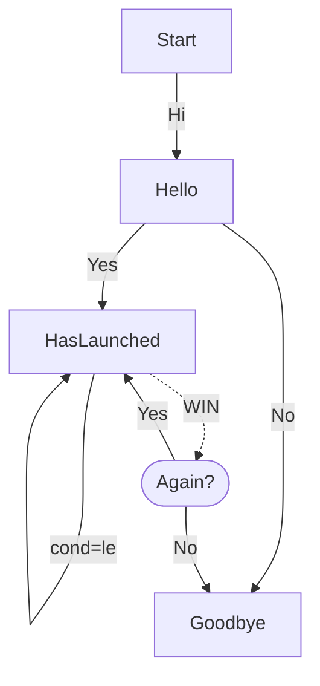
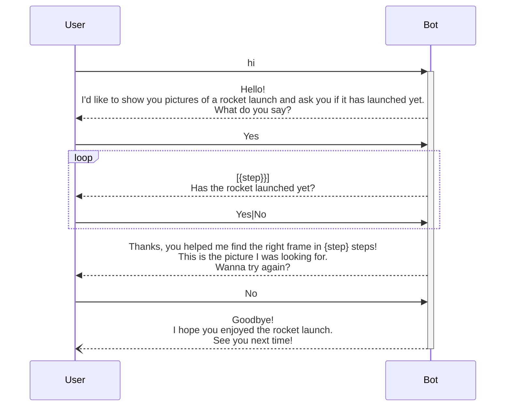

# Rocket Man 🚀
Rocket-loving bot based on [BERNARD](https://github.com/BernardFW/bernard) Framework.


## Description
This bot is a simple game where the user is shown a series of pictures of a rocket launch and is asked if the rocket has launched yet.
The bot will then try to find the picture where the rocket has just launched in as few steps as possible.

## Installation
1. Clone this repository
2. Copy `.env.example` to `.env` and fill in the values (see below)
3. Run `docker compose up`

## Environment variables
| Variable           | Description                                                                                                       |
| ------------------ | ----------------------------------------------------------------------------------------------------------------- |
| BERNARD_BASE_URL   | The base URL of the bot once it's deployed                                                                        |
| TELEGRAM_TOKEN     | Your Telegram bot token [obtained with @BotFather](https://core.telegram.org/bots/tutorial#obtain-your-bot-token) |
| WEBVIEW_SECRET_KEY | A secret key used to sign the webview URL                                                                         |
| SENTRY_DSN         | Your Sentry DSN (optional)                                                                                        |

## Local development
You can run the bot locally using Poetry:
```shell
poetry install
source $(poetry env info --path)/bin/activate
./manage.py run
```
Make sure you have a Redis instance running locally and that you have the environment variables defined in the `.env` file.

## Bot flow
The bot follows this flow:

for more detail you can see the [transitions](rocket_man/transitions.py) file.

## Sample conversation
Here's a sample conversation with the bot:

